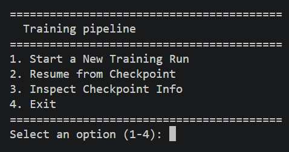
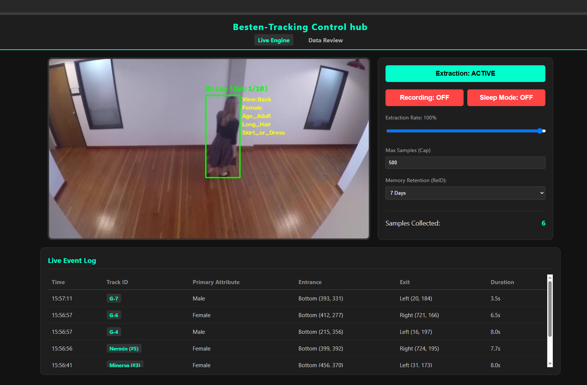
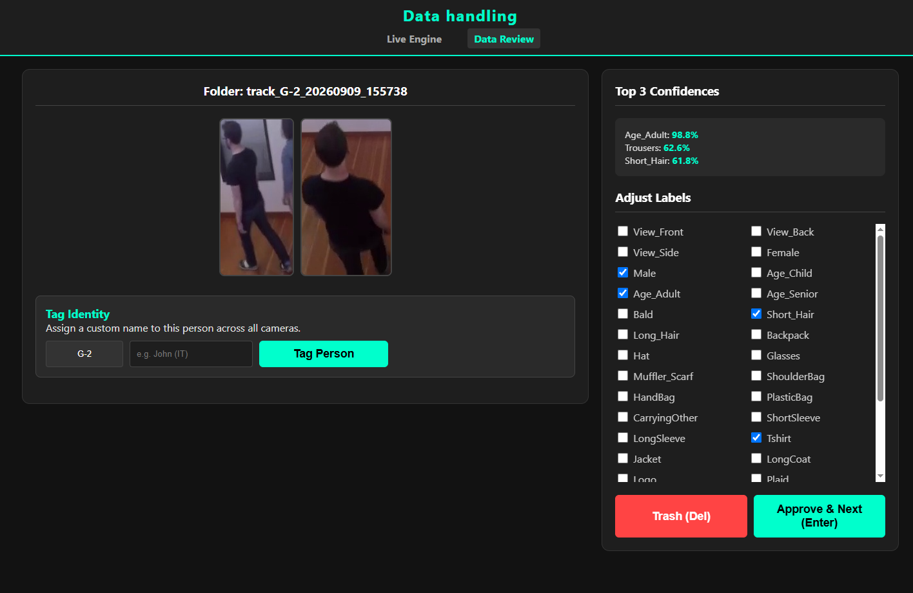

# Real-Time Human Tracking, Identity & Behavioral Analytics Pipeline

A production-ready, **dockerized** computer vision system combining **YOLO (ByteTrack)** and **OSNet (ReID)** for persistent human tracking and identity management. Powered by a custom-engineered lightweight CNN (**Besten**) that is pruned and then optimized via ONNX Runtime, this pipeline delivers real-time attribute profiling, automated authorization tagging, and spatial behavioral mapping. Engineered to run efficiently on standard CPU hardware for cost-effective edge deployment, the system also features a built-in data extraction and auto-labeling pipeline—empowering you to continuously retrain the model and push accuracy even higher for your specific environment.

---

##  About the Model (`Besten`)

Unlike traditional heavy computer vision backbones (such as ResNet-50) that can suffer from diminishing returns and bloated parameter counts, this pipeline is built around **`Besten`** my custom-engineered, lightweight CNN specifically optimized for cost-effective performance. You can customize the layers to get whatever depth and power you need to maximize feauture extraction, then you can prune it down, keeping as much as you need. Besten can be many things however and it works even better as a Hydra with several diffrerent heads that have different SE and group_width.


The `Besten` model achieves its CPU-friendly performance through a combination of a scalable topological layout and aggressive parameter pruning. 

### The Dynamic `layer_config`
Instead of relying on a rigid, hardcoded network depth (like standard ResNet or MobileNet variants), the model builds its architecture dynamically from a configuration tuple list `[(repeats, out_channels, stride), ...]`. 

The production checkpoint utilizes the following 5-stage progression:
```python
layer_config = [
    (4, 64, 2),   # Stage 1: 4 bottleneck blocks, 64 channels
    (4, 128, 2),  # Stage 2: 4 bottleneck blocks, 128 channels
    (4, 256, 2),  # Stage 3: 4 bottleneck blocks, 256 channels (RC_Layer activated)
    (4, 512, 2),  # Stage 4: 4 bottleneck blocks, 512 channels
    (1, 1024, 2)  # Stage 5: 1 final block, scaling to 1024 channels
]

### Architectural Advantages
1. **Grouped Convolutions (RegNet Efficiency):** Inside the bottleneck layers (`conv2`), the model uses grouped convolutions (`groups = mid_c // group_width`), drastically slashing Floating Point Operations (FLOPs) and parameter size while preserving high-dimensional representation power.
2. **Squeeze-and-Excitation (SE) Attention:** Every bottleneck integrates an SE channel attention block (`nn.AdaptiveAvgPool2d` + reduction/expansion layers + hard-sigmoid activation) that dynamically recalibrates channel-wise feature responses, allowing the network to emphasize salient pedestrian traits (e.g., backpacks, logos) and suppress background noise.
3. **Custom `RC_Layer` (Residual Calibration):** Applied in the final high-level blocks (`out_c >= 256`), the specialized `RC_Layer` uses learnable parameters ($\mu$ and $\sigma$) alongside a fast error-function approximation (`fast_erf`) to center, scale, and soft-threshold features. This acts as an internal regularizer, stabilizing semantic representations for sparse or tricky attributes.
4. **Flexible & Scalable Layout:** Rather than a rigid hardcoded architecture like standard ResNet variants, `BestenSingle` uses a dynamic `layer_config` tuple list `[(repeats, out_channels, stride), ...]`, making it uniquely adaptable for hardware-constrained edge deployments.

###  Hybrid Design Philosophy (Bridging CNNs & Vision Transformers)
While structurally a CNN, `BestenSingle` incorporates modern design paradigms shared with Vision Transformers (ViTs):
* **Channel-Wise Attention:** Much like a Transformer's self-attention mechanism weights different tokens, the SE blocks dynamically score and scale feature channels based on global context, ensuring the model focuses on critical semantic clues rather than static spatial templates.
* **Global Context Flow:** Through adaptive pooling, global image context is captured and redistributed across feature maps early in the pipeline, mimicking the wide receptive fields characteristic of attention-based models.

---

##  Optimization & Production Readiness
* **Data-Driven Dynamic Thresholding:** Bypassed naive 0.5 decision boundaries by performing grid-search validation across 99 thresholds per class, optimizing for Mean Accuracy (mA) and driving overall performance into the high **88% mA** bracket.
* **Model Pruning:** Utilizing **L1 Unstructured Magnitude Pruning**, the model was compressed down to **49.67% sparsity** (reducing active parameters to **3.2M**) with **0.0% loss in validation accuracy**.
* **Storage Footprint:** Raw PyTorch checkpoint size reduced to 25.18 MB, collapsing down to **14.27 MB** compressed—ideal for rapid OTA updates to edge cameras or smart-city infrastructure control centers.
---

##  Attribute Schema (36 Classes)
* **Viewpoint:** Front, Back, Side
* **Demographics & Identity:** Female, Male, Age_Child, Age_Adult, Age_Senior
* **Hair & Head:** Bald, Short_Hair, Long_Hair, Hat, Glasses, Muffler_Scarf
* **Upper Body:** ShortSleeve, LongSleeve, Tshirt, Jacket, LongCoat, Logo, Plaid, Stripe
* **Lower Body:** Trousers, Jeans, Shorts, Skirt_or_Dress
* **Footwear:** Boots, Sneakers, LeatherShoes, Sandals
* **Bags & Carrying:** Backpack, ShoulderBag, HandBag, PlasticBag, CarryingOther

---

##  Training Augmentation Pipeline
To ensure robustness against occlusion, poor lighting, and motion blur in real-world camera feeds, our training regimen incorporates rigorous spatial, color, and occlusion augmentations:

```python
T.Compose([
    T.RandomHorizontalFlip(p=0.5), 
    T.RandomAffine(degrees=5, translate=(0.05, 0.05)),
    T.ColorJitter(brightness=0.2, contrast=0.2, saturation=0.2, hue=0.05),
    T.RandomApply([T.GaussianBlur(kernel_size=3)], p=0.2),
    T.ToTensor(),
    T.Normalize(mean=[0.485, 0.456, 0.406], std=[0.229, 0.224, 0.225]),
    T.RandomErasing(p=0.2, scale=(0.02, 0.1)) 
])
```

## How to train 

Run `cli.py` to start your own training regimen if you want a stronger model. The provided baseline is lightweight and adequate—offering excellent bang for the buck. However, you can customize the strength of the `Besten` layers to squeeze out a few extra percentage points of accuracy at the expense of a heavier model footprint.



---

##  How it Works

In our specific implementation, temporal confidence averaging relies on a dynamic, viewpoint-driven buffer system. For each tracked individual, the engine collects a rolling collection of up to 10 localized image crops. Rather than continuously averaging every frame indiscriminately, the system uses the back, side, and front classification logic as a structural trigger. 

Whenever the model detects a distinct change in the pedestrian's viewing angle—such as turning from a frontal orientation to a side profile—it instantly forces a reevaluation of the 10-image buffer. This allows the system to extract and aggregate the highest confidence scores from that specific optimal viewing window, locking in accurate attributes (like a backpack seen from the rear) and discarding angle-specific noise right as the subject's orientation shifts.

---

##  ReID Synergy & Automated Data Labeling

This viewpoint-driven 10-image buffering logic works in perfect synergy with the OSNet Re-Identification (ReID) engine to do more than just track—it actively generates high-quality training data.

When a person turns, their spatial profile changes drastically. A standard tracking algorithm might lose the bounding box or assign a completely new ID. However, OSNet extracts deep visual embeddings that maintain a persistent **Global ID** even as the subject transitions from a Front view to a Side or Back view.

This creates a powerful "data flywheel" effect for future model training:
* **The Identity Anchor:** Because ReID mathematically guarantees that the person facing forward is the exact same person walking away, the system bridges the gap between different viewpoints.
* **Multi-Angle Auto-Labeling:** Every time the engine detects a shift in angle, it evaluates and flushes the 10-image buffer. The system can export these localized crops and automatically tag them with the finalized Master Profile.

---

##  Dockerized Control Center
**Full-Tracking Capabilities + Tripwire + Training-Data Extraction Pipeline + Identification Labeling**



This system relies on a multi-stage AI pipeline. Instead of running one monolithic model, the architecture cascades three specialized ONNX models. This approach keeps the inference loop fast, lightweight, and highly modular.

1. **Spatial Detection (YOLOv11)**
   * **Role:** The Finder.
   * **How it works:** YOLO acts as the eyes of the system. It scans every incoming video frame in real-time and draws precise bounding boxes around all people. It filters out background noise and passes only the isolated, cropped images of pedestrians down the pipeline.

2. **Identity & Memory (OSNet ReID + ByteTrack)**
   * **Role:** The Tracker.
   * **How it works:** Knowing someone is in the frame is only half the battle; the system needs to know if they are the same person from a minute ago. 
     * **ByteTrack** calculates the physical trajectory of the bounding boxes frame-to-frame.
     * **OSNet (Re-Identification)** analyzes the visual appearance of the person inside the box, generating a unique mathematical signature (an embedding). If a person walks behind a pillar, leaves the frame, or changes direction, OSNet matches their visual signature against a persistent "Memory Vault" to reassign their original Global ID.

3. **Tracking PAR (Besten)**
   * **Role:** The Profiler.
   * **How it works:** Once a person is detected and assigned a stable tracking ID, the PAR model analyzes their cropped image. It outputs confidence probabilities across 36 distinct attributes—identifying viewing angles, clothing types, accessories (like backpacks or hats), and general demographic traits.

---

## 📂 Data Extraction

Every environment is different, and accuracy increases with relevant training data. The pipeline allows you to extract data from inference effortlessly. With simple labeling, you can stack relevant training data to quickly fine-tune the model to work perfectly for your specific deployment conditions.



---

## 🪪 ReID Identification

Built into the data-extraction pipeline is the ReID system, which allows you to identify specific individuals and tag them. This is highly useful for marking authorized or unauthorized personnel. With this capability, you can build customized logic for external systems to respond differently based on the ReID tag.

---

## 🌙 Sleep Mode

Not all deployments involve high traffic. If you are monitoring a low-traffic area, the system defaults to a sleep mode to conserve compute resources. It will instantly wake up and resume full inference as soon as it detects movement in the frame.


##  Multi-Camera Scaling & Cross-Camera ReID

The architecture is designed to extend beyond a single camera. Because the system decouples stream ingestion from the inference engine, users can scale the deployment to monitor multiple RTSP streams simultaneously across a facility. 

### How Cross-Camera Tracking Works
The true power of the **OSNet ReID** model is its ability to maintain identity across entirely disjointed camera feeds. To implement multi-node tracking, users simply need to ingest multiple streams (e.g., `streamer_1`, `streamer_2`) and process them concurrently via Python threading or multiprocessing.

* **The Shared Memory Vault:** The secret to cross-network tracking is the ReID embedding dictionary (e.g., `reid_gallery.pkl`). By ensuring all camera threads share the same active memory vault in RAM, they pool their tracking intelligence.
* **Global ID Persistence:** If a subject (Global ID #42) walks out of Camera 1's frame at the main entrance and appears on Camera 2 down a side corridor a minute later, the system extracts their new visual embedding, queries the shared vault, and instantly reassigns ID #42.
* **Unified Master Profile:** Attributes detected on Camera 1 (like a frontal logo) are merged with attributes detected on Camera 2 (like a backpack seen from behind), creating a comprehensive, multi-angle Master Profile.

###  Customizing the Web Dashboard
The provided Flask backend and HTML/JS frontend (`/templates`) serve as a foundational template. The UI is completely open for modification:

* **Grid Layouts:** Users can easily modify the CSS to support side-by-side video grids for multi-stream monitoring.
* **Global Tracking Logs:** By tapping into the backend JSON API (`/api/stats`), developers can build custom global logs that display real-time tracking events (e.g., *"Target #42 detected on CAM_02"*).
* **Automated Alerts:** Since the data is parsed locally, users can write simple scripts to trigger webhooks, Slack messages, or local alarms when specific conditions (like unauthorized ReID tags or tripped line-crossings) occur across the network.